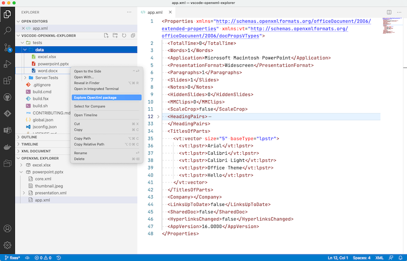

# OpenXML Package Explorer for VS Code

Display the content of a OpenXml (*.pptx, *.docx, *.xlsx) file in a Tree Explorer

## Features

* Explore content of OpenXml packages (parts and their relationships)
* Explore preformatted content of XML parts (read only)
* Implemented on top of official SDK from MS [System.IO.Packaging](https://www.nuget.org/packages/System.IO.Packaging/)

## Requirements

* Visual Studio Code - https://code.visualstudio.com
* .NET 5.0 Runtime - https://dotnet.microsoft.com/download/dotnet/5.0

## Credits

Ideas and features:

* [Zip Explorer](https://github.com/stef-levesque/vscode-zipexplorer)
* [ionide-vscode-fsharp](https://github.com/ionide/ionide-vscode-fsharp)
* [PackageExplorer](https://archive.codeplex.com/?p=packageexplorer)
* [Open XML Package Editor for Modern Visual Studios](https://github.com/bsivanov/Open-XML-Package-Editor-Power-Tool-for-Visual-Studio)

Technologies:

* [vscode-docs](https://github.com/Microsoft/vscode-docs)
* [Fable](https://fable.io)
* [fable-node](https://github.com/fable-compiler/fable-node)
* [Fable.Remoting](https://zaid-ajaj.github.io/Fable.Remoting/)
* [ionide-vscode-helpers](https://github.com/ionide/ionide-vscode-helpers)
* [Saturn Framework](https://saturnframework.org)

## License

[MIT](LICENSE.md)
